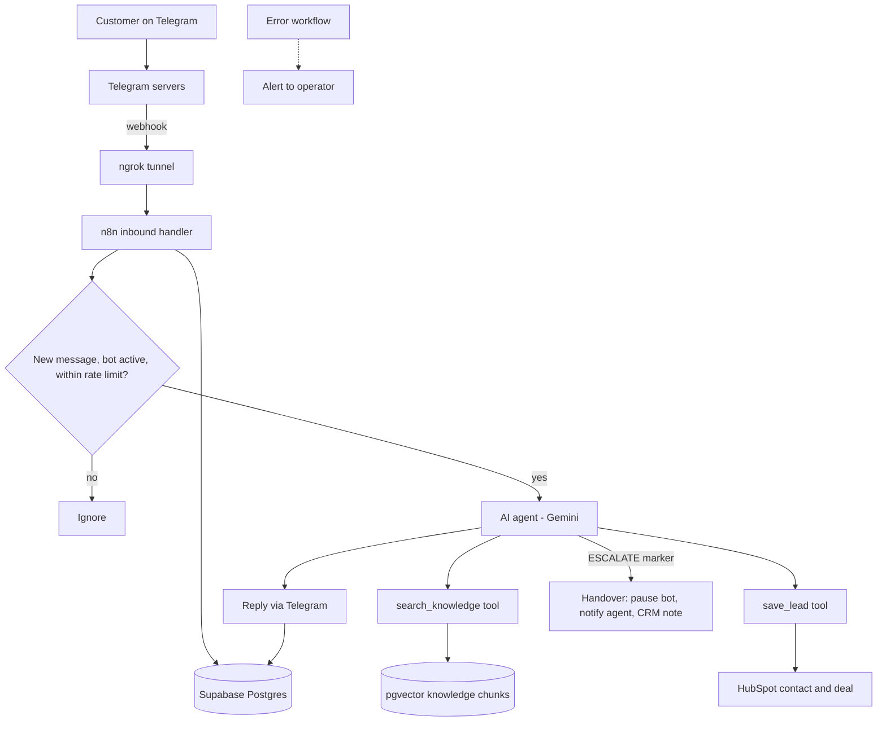

# Dubai Real Estate AI Assistant

An AI customer assistant for a **fictional** Dubai real estate brokerage ("Marina Crest Properties"), built with n8n, Gemini, Supabase (pgvector) and HubSpot. It answers questions from a knowledge base, qualifies leads, saves them to a CRM, and hands over to a human agent when it should.

> **All data in this project is synthetic.** The company, listings, customers and documents are fictional and AI-generated. Market figures are illustrative and not advice.

**Case study:** [docs/case-study.md](docs/case-study.md)

## What it does

- Answers customer questions on Telegram, grounded in a knowledge base (RAG), in English and Arabic.
- Qualifies leads in natural conversation (intent, budget, area, bedrooms, timeline, financing) and saves them to **HubSpot** as a contact and a deal, with a completeness score.
- Hands over to a human when asked or when needed (negotiation, complaints, visas, mortgages): the bot goes silent, an agent is notified with a summary, and a note is added to the CRM contact.
- Ignores duplicate deliveries, rate-limits spam, and alerts the operator when a workflow fails.

## Architecture



## Tech stack

| Layer | Choice |
| --- | --- |
| Orchestration | n8n community edition (self-hosted, Docker Compose) |
| Channel | Telegram Bot API (channel kept separate from logic; WhatsApp Cloud API is the documented next step) |
| Public webhook | ngrok free tunnel |
| LLM and embeddings | Google Gemini API (free tier); `gemini-embedding-001` with separate document and query task types |
| Database and vectors | Supabase Postgres with pgvector |
| CRM | HubSpot free CRM (service key, REST API, custom properties) |
| Source control | Git and GitHub |

All of the above is free to use.

## How a message flows

1. Telegram posts the message to the n8n webhook through the tunnel.
2. The message is logged. A unique constraint on Telegram's `update_id` makes the insert idempotent, so duplicate deliveries are ignored.
3. The customer's bot status and message rate are checked (paused or spamming customers get no reply).
4. The AI agent reads the message, with per-customer memory stored in Postgres.
5. For factual questions it calls `search_knowledge`: the question is embedded and the closest chunks are retrieved from pgvector, with a similarity floor to drop weak matches.
6. When the customer states new requirements it calls `save_lead`, which updates the HubSpot contact and deal. The customer's identity is injected by the workflow, never chosen by the model.
7. The reply is sent and logged. If the reply carries the escalation marker, the bot is paused for that customer, the agent is notified, and a note is added in HubSpot.

## Key design decisions

- **RAG, tested on its own first.** Retrieval is evaluated separately from the agent, because most RAG failures are retrieval failures.
- **Two layers against made-up answers:** a similarity floor on retrieval, and strict grounding rules in the agent's instructions. The floor alone is not enough, because similarity scores for unanswerable questions overlap those of answerable ones.
- **Idempotency everywhere:** message ingestion, knowledge ingestion (upserts) and customer records.
- **Own customer table** maps Telegram chat IDs to HubSpot IDs, avoiding HubSpot's search lag and giving a fast status check.
- **Escalation is a rule, not retrieval:** negotiation, complaints, visa and mortgage questions are handled by explicit instructions and a marker the workflow acts on.
- **Fail loudly:** dimension checks on embeddings, an error workflow with alerts, and a customer-facing fallback when the AI call fails.

## Evaluation

| Test | Cases | Result |
| --- | --- | --- |
| Retrieval, round 1 (easy, written from the documents) | 22 | 100% correct chunk in the top 3, 95% ranked first |
| Retrieval, round 2 (casual wording, one Arabic question, plus 8 out-of-scope questions) | 34 in scope | 97% top 3, 94% top 1 |
| Agent, round 1 | 35 | 18 passed (51%). Failures traced to the test setup (the `intent` input was not defined in the tool workflow's trigger, so it never arrived) and to the agent not working out the customer's intent, which I fixed by clarifying the system prompt |
| Agent, round 2 (after the fixes) | 35 | **35 passed (100%)**: facts 11/11, qualification 6/6, Arabic 3/3, out-of-scope 5/5, adversarial 4/4, escalation 6/6 |

Agent checks cover factual answers (the right tool was called and the reply contains the expected facts), qualification (`save_lead` captures only what the customer stated), Arabic, out-of-scope questions, prompt-injection attempts, and escalation (including no false escalations). Rule-based checks are complemented by reading every reply. Details: [docs/evaluation-log.md](docs/evaluation-log.md).

**How to read these numbers.** The 35 test cases were written by me, from the same documents the assistant uses, and the checks are rule-based, so a full pass shows the assistant behaves correctly on a realistic range of cases, not that it is flawless. The first round is kept in the table on purpose: it showed that an evaluation harness can itself be wrong, which is why every failure was investigated before changing the assistant. A production evaluation would add cases from real conversations and an independent judge of answer quality.

## Repository structure

```
docker-compose.yml     n8n and the tunnel
.env.example           required environment variables (no secrets)
workflows/             exported n8n workflows (00 error alert ... 10 agent evaluation)
knowledge/             synthetic knowledge documents and the fact sheet
docs/                  schema.sql, evaluation log, runbook, case study, problems and fixes
```

## Setup

**Prerequisites:** Docker Desktop, Git, and free accounts for Telegram (BotFather), ngrok, Supabase, Google AI Studio and HubSpot.

1. Clone the repo. Copy `.env.example` to `.env` and set `N8N_ENCRYPTION_KEY` (a long random string, keep a copy safe), `NGROK_AUTHTOKEN` and `NGROK_DOMAIN`.
2. Run `docker compose up -d` and open `http://localhost:5678` to create the owner account.
3. In Supabase, run `docs/schema.sql`, then insert your agent's Telegram chat ID into the `config` table (`key = 'agent_chat_id'`).
4. In HubSpot, create a service key (contacts and deals read/write scopes), the nine custom contact properties (`telegram_chat_id`, `intent`, `budget_aed`, `preferred_areas`, `bedrooms`, `timeline`, `financing`, `lead_score`, `bot_status`) and rename the deal stages. Set the stage and pipeline IDs in the `Deal rules` node of `09-tool-save-lead`.
5. In n8n, create credentials (names only, never commit values): `supabase-postgres` (Postgres, session pooler), `gemini-api` (Google Gemini API key), a Telegram credential (bot token) and `hubspot-bearer` (Header Auth: `Authorization: Bearer <service key>`).
6. Import the workflows from `workflows/` and relink the credentials. Set `00-error-alert` as the error workflow of `05`, `07` and `09`.
7. Run `03-ingest-knowledge` to load the knowledge base, then `04-retrieval-test` to check retrieval.
8. Publish `07-telegram-assistant` and message your bot.

## Known limitations

- Telegram is the live channel; WhatsApp would need the Cloud API, Meta business setup, a 24-hour customer-service window and approved templates.
- It runs on a laptop behind a free tunnel, so it is offline when the laptop is. The same compose file deploys to a VPS.
- Free tiers: model rate limits, tunnel quotas, and Supabase pausing idle projects. The error alert depends on the database, so it cannot fire if the database itself is down.
- Knowledge ingestion adds and updates chunks but does not delete chunks for removed sections.
- No calendar booking, follow-up reminders, or agent command to hand a chat back to the bot (done with a SQL update today).
- No consent or data-retention flow. Real customer data would require UAE data-protection compliance work (PDPL).

## Next steps

Deploy to an always-on server; add the WhatsApp adapter; add viewing booking; add a `/resume` command; add an LLM-based judge to the evaluation; stale-chunk cleanup; consent message and data retention.
